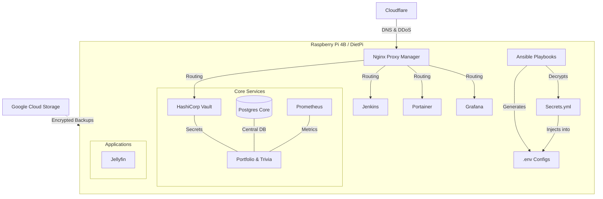

# Rajiv Wallace Home Lab - Infrastructure as Code

> **Portable, Containerized, Ansible-Orchestrated Infrastructure for Raspberry Pi 4B Home Lab**

A complete Infrastructure as Code (IaC) solution for deploying and managing a production-ready homelab environment. This project demonstrates DevOps best practices including containerization, automated secrets management (Ansible Vault), configuration generation (Jinja2), and automated disaster recovery.

## 🏗️ Architecture Overview

The system uses a **Centralized Service Architecture**. Unlike typical Docker setups where every app has its own database, this project mimics enterprise environments by utilizing shared, high-availability core services to reduce resource overhead.

**Orchestration Stack:**

- **Terraform**: Provisions cloud resources (Google Cloud Storage buckets, Cloudflare DNS).
- **Ansible**: Manages configuration management, secrets injection, and service bootstrapping.
- **Docker Compose**: Defines container services and networks.



## 🚀 Features

- **Ansible-First Deployment**: One-click bootstrap script (`setup.sh`) handles dependencies, configuration, and deployment.
- **Automated Secrets Management**: Sensitive data is encrypted via **Ansible Vault** and injected into services at runtime.
- **Dynamic Configuration**: Service `.env` files are generated from Jinja2 templates (`.env.j2`), ensuring consistency.
- **Disaster Recovery**: Automated restoration of Docker volumes from Google Cloud Storage (GCS) during setup.
- **HashiCorp Vault**: Centralized secrets management for running applications.
- **Health Monitoring**: Prometheus + Grafana + Alertmanager with Discord notifications.

## 📁 Project Structure

```
homelab-iac/
├── ansible/                          # Configuration Management
│   ├── group_vars/all/               # Global configs & Secrets
│   │   ├── config.yml                # Non-sensitive vars
│   │   └── secrets.yml               # Encrypted secrets (Vault)
│   ├── inventory/                    # Host definitions
│   ├── foundation.yml                # Main setup playbook
│   ├── restore.yml                   # Disaster recovery playbook
│   └── setup.sh                      # Bootstrap script
├── terraform/                        # Cloud Infrastructure (GCS, Cloudflare)
├── services/                         # Service configurations
│   ├── core/                         # NPM, Jenkins, Vault, Pihole
│   ├── database/                     # PostgreSQL, pgAdmin
│   ├── monitoring/                   # Prometheus, Grafana
│   ├── media/                        # Jellyfin
│   └── ...                           # Each service has docker-compose.yml & .env.j2
└── scripts/                          # Backup scripts
```

## 🎯 Quick Start

### Prerequisites

- Raspberry Pi 4B with DietPi (or similar Debian-based OS)
- Git installed
- Google Cloud Storage bucket (provisioned via Terraform)
- Cloudflare Domain (configured via Terraform)

### Initial Setup

#### 1. Clone & Prepare Secrets

Instead of manually copying `.env` files, we use Ansible Vault.

```bash
git clone [https://github.com/rajivghandi767/homelab-iac.git](https://github.com/rajivghandi767/homelab-iac.git)
cd homelab-iac

# 1. Create your secrets file
cp ansible/group_vars/all/secrets.yml.example ansible/group_vars/all/secrets.yml

# 2. Populate it with your GCS keys, passwords, and tokens
nano ansible/group_vars/all/secrets.yml

# 3. Encrypt the secrets file (Important!)
ansible-vault encrypt ansible/group_vars/all/secrets.yml
# You will be prompted to set a vault password. Remember this.
```

#### 2. Run the Bootstrap Script

The `setup.sh` script handles everything: installing Ansible, Docker, generating `.env` files from templates, and launching containers.

```bash
cd ansible
chmod +x setup.sh
./setup.sh
```

**What happens next?**

1.  **Dependencies**: Installs Docker, Python, Ansible, and GCP libraries.
2.  **Config Generation**: Decrypts `secrets.yml` and compiles all `.env.j2` templates into actual `.env` files in `/opt/homelab/services`.
3.  **Restoration (Optional)**: Prompts you to restore data from GCS. If `y`, it downloads, decrypts, and injects data into Docker volumes.
4.  **Launch**: Brings up all Docker Compose stacks in the correct order.

## 🔐 Secrets & Configuration

### Ansible Vault

All sensitive data (API keys, DB passwords) resides in `ansible/group_vars/all/secrets.yml`. This file must be encrypted before committing or running in production.

To edit secrets later:

```bash
ansible-vault edit ansible/group_vars/all/secrets.yml
```

### Jinja2 Templates

Service configurations are dynamic. For example, `services/core/pihole/.env.j2` looks like this:

```jinja2
TZ='{{ timezone }}'
SECURE_PASSWORD='{{ pihole_secure_password }}'
```

Ansible replaces these variables with values from `secrets.yml` and `config.yml` during the setup phase.

## 💾 Backup & Restore

### Automated Backups

Backups are performed by the `scripts/backup_volumes.sh` script, which:

1.  Stops critical containers (to ensure consistency).
2.  Compresses Docker volumes.
3.  Encrypts tarballs using GPG.
4.  Uploads to Google Cloud Storage.

### Disaster Recovery

Restoration is fully automated via `ansible/restore.yml`.

When running `./setup.sh`, select **"Yes"** at the Restore prompt. Ansible will:

1.  Connect to GCS using the Service Account in `secrets.yml`.
2.  Download the `latest` encrypted backups.
3.  Decrypt them using your GPG passphrase.
4.  Inject the data directly into the named Docker volumes (e.g., `jenkins_data`, `vault_data`).

## 🌐 Network Architecture

| Network      | Purpose               | Services                               |
| ------------ | --------------------- | -------------------------------------- |
| `core`       | Core infrastructure   | Jenkins, NPM, Vault, Pihole, Portainer |
| `database`   | Database services     | PostgreSQL, pgAdmin                    |
| `monitoring` | Monitoring & alerting | Prometheus, Grafana, Alertmanager      |
| `media`      | Media & Apps          | Jellyfin, Portfolio, Trivia            |

## 📊 Monitoring

### Access Dashboards

- **Grafana**: https://grafana.rajivwallace.com
- **Prometheus**: https://prometheus.rajivwallace.com
- **Alertmanager**: https://alertmanager.rajivwallace.com

### Alert Configuration

Alerts are defined in `services/monitoring/prometheus/alerts/alert_rules.yml`. Notifications are routed to **Discord** via Alertmanager.

## 📝 License

MIT License - See [LICENSE](LICENSE) for details

## 👤 Author

**Rajiv Wallace**

- Portfolio: https://rajivwallace.com
- GitHub: [@rajivghandi767](https://github.com/rajivghandi767)
- LinkedIn: [Rajiv Wallace](https://linkedin.com/in/rajiv-wallace)

---

**Note**: This is a production infrastructure project showcasing real-world DevOps practices. All services run on a single Raspberry Pi 4B (Quad-Core + 8GB RAM) demonstrating efficient resource utilization and proper architectural patterns.
